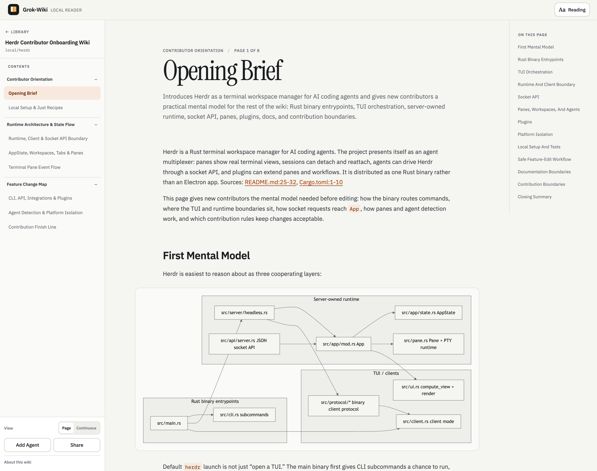

# Grok-Wiki Viewer (local-first)

A **local-first, browser-based reader for [Grok-Wiki](https://grok-wiki.com) JSON artifacts.** Point it at a `wiki-*.json` file that an agent generated in your project folder and read it as a clean, navigable wiki — with Mermaid diagrams, a table of contents, and full-text-friendly Markdown — all on your machine. No account, no upload to a cloud, no telemetry.

> A simple Markdown previewer for Grok wikis (in JSON format), with Mermaid diagrams built in — everything runs locally.



## Why this exists

The workflow this is built for:

1. You use the **grok-wiki skill with a coding agent** (Claude, Codex, Cursor, etc.) directly in a project folder — not a separate desktop app.
2. The agent writes a `wiki-*.json` artifact into the repo (or your local wiki root).
3. You want to **read that wiki in a browser** without shipping it anywhere.

That's it. Generate wikis from the CLI/agent, view them locally. This tool is the "view it in the browser" step — a thin, static, offline reader that turns the JSON into a proper reading surface.

**Local-first directive:** every operation works offline. The default flow needs no server and no network — drop a JSON file in the browser and read. An optional local Bun server can auto-discover wikis on disk, but it never leaves `127.0.0.1` unless you explicitly expose it.

## What it is / isn't

- ✅ A read-only viewer for Grok-Wiki `wiki-*.json` artifacts
- ✅ Markdown + Mermaid renderer with TOC, sidebar, themes, and exports
- ✅ Fully local: browser-only mode, or a local file-scanning server
- ❌ Not a wiki generator — use the grok-wiki skill/agent to create the JSON
- ❌ Not a hosted service — you run it

## Quick start

Requires [Bun](https://bun.sh) `>= 1.0`.

```bash
git clone https://github.com/smrnjeet/grok-wiki-viewer.git
cd grok-wiki-viewer
bun install
bun run dev
```

Open **http://127.0.0.1:5173**.

- Vite UI on port `5173`
- Bun API on port `4173` (proxied at `/api`)

You can now either **drag a `wiki-*.json` onto the page**, or — if you have wikis on disk in a known root — they'll be auto-discovered by the local server.

## Two ways to load a wiki

### 1. Browser-only (zero server)

Drag & drop a `wiki-*.json` file onto the library, or paste a public URL to one. The file is parsed in the browser and cached in IndexedDB. Nothing is uploaded. This works even on a fully static build with no backend.

### 2. Local server auto-discovery

The bundled Bun server scans your disk for `**/wikis/wiki-*.json` and lists them automatically. Roots scanned (deduped by wiki id):

1. `$GROK_WIKI_ROOT` or `$RLM_WIKI_ROOT` (if set)
2. `~/Library/Application Support/ai.grokwiki.desktop/grok-wiki/`
3. `~/.rlm-wiki/`

Point it at your project's wikis:

```bash
GROK_WIKI_ROOT=/path/to/your/project bun run dev
```

## CLI-driven workflow

Everything can be driven from the terminal — generate with your agent, view with one command.

```bash
# 1. In your project, have the grok-wiki agent/skill generate a wiki artifact
#    -> produces something like ./wikis/wiki-my-repo.json

# 2. Point the viewer at that folder and open it
GROK_WIKI_ROOT="$(pwd)" bun run dev
# open http://127.0.0.1:5173

# Or run against the current directory as a one-off:
GROK_WIKI_ROOT="$PWD" bun --watch server/index.ts   # API only on :4173
```

The server also exposes plain-text/Markdown endpoints for scripting (see [API](#api)).

## Production (local)

```bash
bun run build          # outputs dist/
bun run start          # NODE_ENV=production, serves dist/ + API on :4173
```

Open **http://127.0.0.1:4173**.

## Features

- **Library view** of all discovered local wikis, plus in-browser upload / URL loading
- **Reading modes**: paged (one page at a time) or continuous (single scroll)
- **Navigation**: collapsible sidebar contents + on-this-page table of contents
- **Markdown + Mermaid**: GitHub-flavored Markdown, syntax highlighting, and zoomable Mermaid diagrams
- **Cross-links**: related source files and related pages per section
- **Exports** (generated locally): Markdown, `llms.txt`, `llms-full.txt`, Obsidian ZIP, print/PDF
- **Agent handoff**: copy a ready-to-paste prompt to continue work with an agent
- **Theming**: system / light / dark, with saved typography and reading-width preferences
- **Typed stack**: React 19, TanStack Router + TanStack Query, Vite, Bun

## API

When the server is running (`:4173`), these endpoints are available (also proxied under `/api` in dev):

| Endpoint | Returns |
| --- | --- |
| `GET /api/health` | `{ ok, roots }` |
| `GET /api/wikis` | List of discovered wikis + scan roots |
| `GET /api/wikis/:id` | Full wiki record + agent handoff prompt |
| `GET /api/wikis/:id.md` / `/api/wikis/:id/llms-full.txt` | Full Markdown export |
| `GET /api/wikis/:id/llms.txt` | Compact `llms.txt` |
| `GET /api/wikis/:id/handoff.txt` | Agent handoff prompt |
| `GET /api/wikis/:id/export/obsidian.zip` | Obsidian vault ZIP |
| `GET /api/wikis/:id/pages/:slug.md` | Single page as Markdown |

## Configuration

| Variable | Default | Purpose |
| --- | --- | --- |
| `GROK_WIKI_ROOT` / `RLM_WIKI_ROOT` | — | Extra folder to scan for `wiki-*.json` |
| `HOST` | `0.0.0.0` | Server bind host |
| `PORT` | `4173` | Server port |
| `CORS_ORIGIN` | `*` | Allowed origin for the API |
| `VITE_API_BASE` | `/api` | Build-time: point the static UI at a remote API |
| `VITE_BASE` | `/` | Build-time: deploy under a subpath (e.g. GitHub Pages) |

See [`.env.example`](./.env.example).

## Deploy (optional)

The frontend is a static SPA; the server is optional. If you want it reachable beyond your machine:

### Static + upload (no server)

Host `dist/` on any static host (Vercel, Netlify, Cloudflare Pages, GitHub Pages). SPA fallback is preconfigured via `vercel.json` and `public/_redirects`. Visitors load wikis by drag/drop or URL. All exports are generated in the browser.

```bash
bun run build            # outputs dist/
# GitHub Pages subpath:
VITE_BASE=/grok-wiki-viewer/ bun run build
```

> A public HTTPS site cannot read a visitor's disk or reach `http://127.0.0.1` (mixed-content + Private Network Access). For live local data, keep it local or use one of the modes below.

### Static + remote API

```bash
VITE_API_BASE=https://your-tunnel.example/api bun run build
```

Expose a local server over HTTPS with a tunnel (`cloudflared tunnel --url http://127.0.0.1:4173`, `ngrok http 4173`) or run it on a VPS. CORS is configurable via `CORS_ORIGIN`.

### Self-hosted (Docker)

Serves the built frontend and the API together.

```bash
docker build -t grok-wiki-viewer .
docker run -p 4173:4173 \
  -v /path/to/wikis:/data/wikis \
  -e GROK_WIKI_ROOT=/data/wikis \
  grok-wiki-viewer
```

Works on Fly.io / Railway / Render / any VPS.

## Project structure

```
src/                 React app (Vite)
  main.tsx           Providers: QueryClient + Router
  router.tsx         TanStack Router route tree
  pages/             LibraryPage, WikiPage
  components/        Sidebar, Markdown, Mermaid, TOC, Share panel, prefs
  lib/               api, queries, types, exports, preferences
server/              Bun API + disk scanner + Markdown export
  index.ts           HTTP server (API + static in prod)
  scanWikis.ts       Wiki discovery on disk
  markdownExport.ts  Markdown / llms.txt / Obsidian builders
scripts/dev.ts       Runs Vite + API together
```

## Tech stack

React 19 · TanStack Router · TanStack Query · Vite 6 · Bun · TypeScript · react-markdown · Mermaid · highlight.js

## Contributing

Contributions welcome — see [CONTRIBUTING.md](./CONTRIBUTING.md).

## License

[MIT](./LICENSE) © jeet
